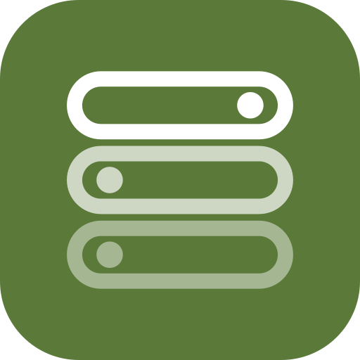
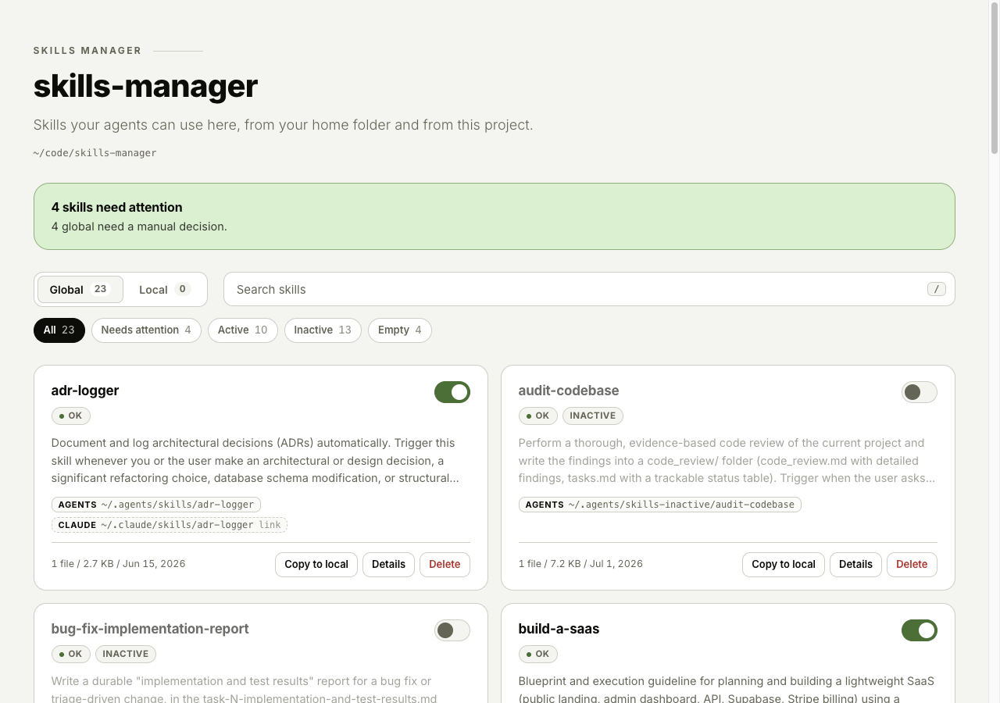
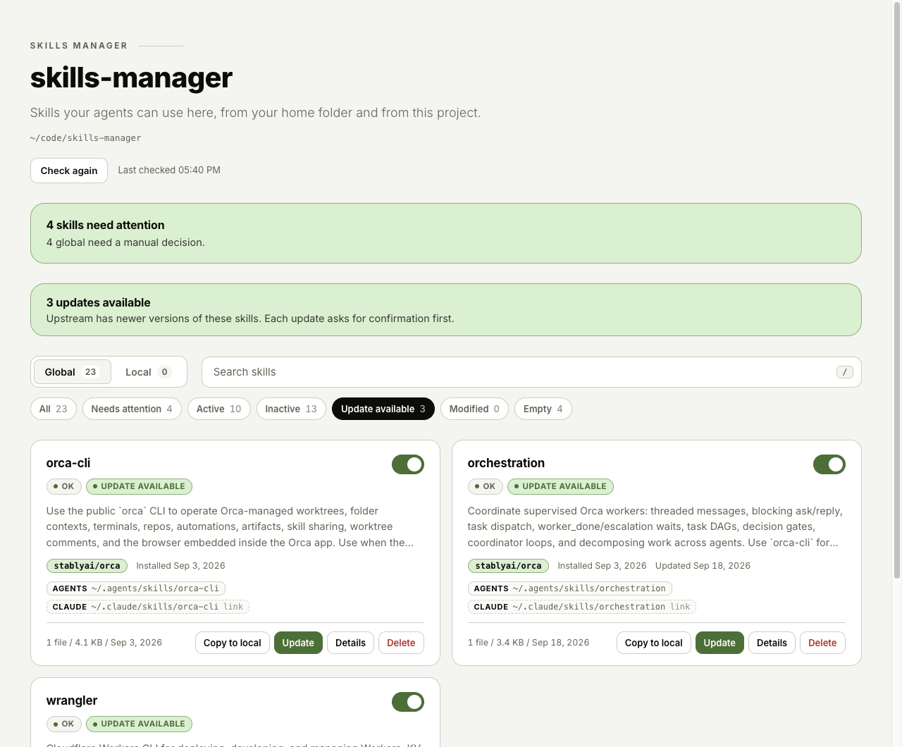

# skm: skills manager

Manage your agent skills (folders with a `SKILL.md`) in one place, from the terminal or
a local web UI. `skm` sees your **global** skills (in your home folder) and your **local**
skills (in the project you are in) at the same time.



- No dependencies, no build step. Node.js 20 or newer is all you need.
- Runs on `127.0.0.1` only; nothing leaves your machine.
- Never really deletes: delete moves the skill to the system Trash (macOS `~/.Trash`, Linux XDG trash).

## Install

```sh
git clone https://github.com/henriquefps/skills-manager.git
cd skills-manager
node -v   # must be >= 20
```

Pick one way to get the `skm` command in your terminal:

**Alias in your shell config** (installs nothing globally). From inside the cloned folder:

```sh
echo "alias skm='node \"$PWD/bin/skm.mjs\"'" >> ~/.zshrc   # or ~/.bashrc
source ~/.zshrc
```

**Or `npm link`** (puts a `skm` command on your PATH):

```sh
npm link
```

Check it with `skm --help`.

## How skills are organized

`skm` assumes this convention, and the `normalize` command brings your skills to it.

| What | Where |
| --- | --- |
| Global central store | `~/.agents/skills/<name>/` (real folder) |
| Claude view (global) | `~/.claude/skills/<name>` (symlink to the central folder) |
| Inactive global skills | `~/.agents/skills-inactive/<name>/` |
| Deleted skills | The system Trash: `~/.Trash` (macOS) or `~/.local/share/Trash` (Linux), outside the repo |
| Local skills | `<project>/.claude/skills` and/or `<project>/.agents/skills` |
| Inactive local skills | `skills-inactive` next to where the skill was |

The project root is the nearest ancestor of the current directory that has `.git`,
`.agents` or `.claude`.

## Quick start

```sh
cd my-project
skm            # opens the web UI (port 4747) for global + local
skm list       # table in the terminal
skm doctor     # lists problems and the command that fixes each one
```

## The web UI

Running `skm` with no arguments starts the server and opens your browser. There you can:

- switch between **Global** and **Local**, search, and filter by status;
- **activate/deactivate** a skill with its toggle;
- **Promote** a local skill to global, or **Copy to local** a global one;
- **Normalize** a skill with a problem (for `diverged`, pick which side to keep);
- **Delete** (moves it to the system Trash), with a confirmation that shows the exact destination;
- open **Details** to see the `SKILL.md` and the file tree;
- use **Fix all** in the problems banner, with a preview of what will change;
- press **Check for updates** to see which tracked skills are outdated, and **Update** them one by one.

Options: `--port <n>` picks the port (if it is taken, the next free one is used) and
`--no-open` skips opening the browser.

## Commands

```
skm                       open the UI for the current directory
skm list [--json]         global and local skills with status
skm doctor                problems found and the suggested fix
skm normalize [name|--all] [--keep agents|claude] [--dry-run]
skm activate <name>       [--local|--global]
skm deactivate <name>     [--local|--global]
skm promote <name>        local -> global (copy)   [--overwrite]
skm pull <name>           global -> local (copy)   [--overwrite] [--target agents|claude]
skm delete <name>         [--local|--global]   # moves to the system Trash; restore it from there by hand
skm outdated [--json]     check the GitHub source of each tracked global skill
skm update <name>         [--force] [--dry-run] [--yes]
skm update --all          [--force] [--dry-run] [--yes]   # only the ones with an update available
```

General options: `--yes` (skip confirmation), `--dry-run` (only show what would happen),
`--json`, `--port <n>`, `--no-open`.

If the same name exists in both global and local, pass `--local` or `--global`.

## Checking and updating skills



Skills installed with `npx skills` are recorded in `~/.agents/.skill-lock.json` (repo, path in the
repo and the git tree hash of the folder). skm reads it, never needs it, and shows the repo in the
`ORIGIN` column of `skm list`. A skill whose folder no longer matches the recorded hash is marked
`[modified]`.

`skm outdated` asks GitHub (one call pair per repo; it uses `GITHUB_TOKEN`, `GH_TOKEN` or `gh auth token`
when available, otherwise it is anonymous) and reports `up-to-date`, `update-available`,
`removed-upstream` or `unreachable`. It runs only when you ask.

`skm update <name>` clones the repo (with your git credentials), moves the old folder to the system
Trash, copies the new one in place and updates the hash and `updatedAt` in the lock file; all other
lock fields and its indentation are kept. A modified skill is refused unless you pass `--force`; an
inactive skill is updated where it lives. Use `--dry-run` to see the plan first.

## Recipes

**Clean up duplicates between `.agents` and `.claude`**

```sh
skm doctor
skm normalize --all --dry-run   # see what will change
skm normalize --all
```

This adopts skills that only exist in `.claude` into `.agents`, replaces identical copies
with a symlink, and creates the missing symlinks. `diverged` skills (different content on
each side) are never resolved on their own:

```sh
skm normalize log-session --keep agents   # or --keep claude
```

**Turn a skill off without deleting it**

```sh
skm deactivate wrangler
skm activate wrangler     # to bring it back
```

When you deactivate a **local** skill, `skm` also adds `skills-inactive/` to the project's
`.gitignore` (only if one exists and nothing already mentions it), so switched-off skills
never end up in your repo.

**Make a project skill global**

```sh
cd my-project
skm promote my-skill
```

**Use a global skill only in this project**

```sh
skm pull my-skill                  # copies into the project's .claude/skills
skm pull my-skill --target agents  # or into .agents/skills
```

## Skill statuses

| Status | Meaning | Fix |
| --- | --- | --- |
| `ok` | All good | |
| `needs-link` | Exists in `.agents`, the symlink in `.claude` is missing | `normalize` |
| `duplicate` | Real folder on both sides, identical | `normalize` |
| `diverged` | Real folder on both sides, different content | `normalize --keep agents\|claude` |
| `claude-only` | Only exists in `.claude` | `normalize` (adopts it into `.agents`) |
| `broken-link` | Symlink points to something that does not exist | review manually |
| `wrong-link` | The `.claude` symlink points somewhere else | `normalize` |
| `empty` | Folder without a `SKILL.md` | review or delete |
| `conflict` | Has Syncthing `*.sync-conflict-*` files | resolve manually |

Hidden folders such as `.trash`, `.stfolder` and `synced` are ignored.

## Development

```sh
npm test    # node:test, always on temp folders
```

To try it without touching your real home, point the home at any folder:

```sh
SKM_HOME=/tmp/fake-home skm list
```

Layout:

```
bin/skm.mjs      CLI
src/core/        filesystem logic (scan, actions)
src/server.mjs   HTTP server + JSON API
src/ui/          UI (HTML, JS and CSS, HFPS theme)
docs/ARCHITECTURE.md   full contract (model, actions, API)
```
