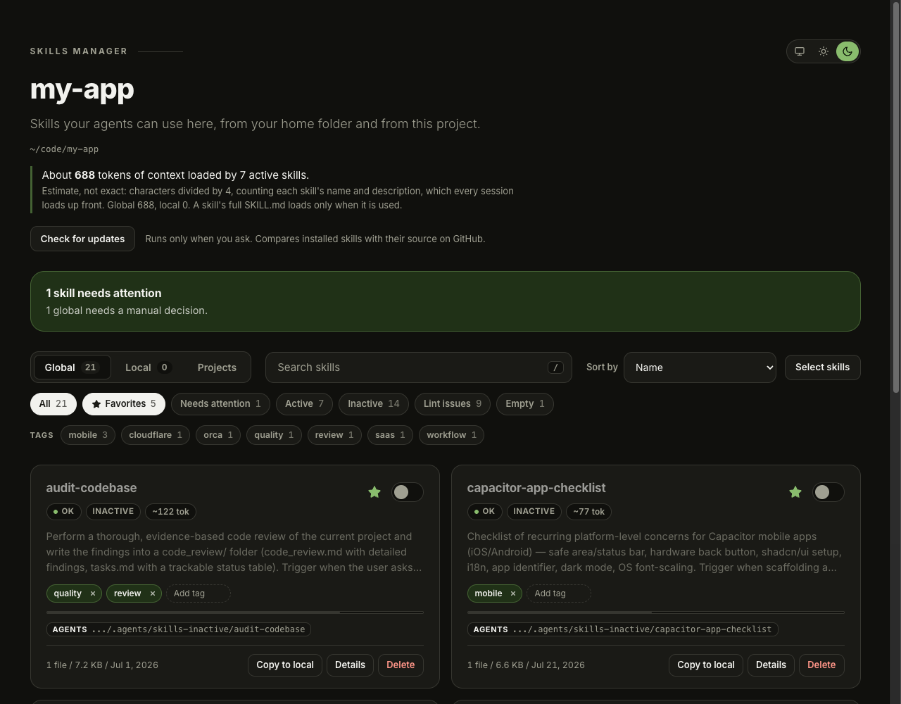
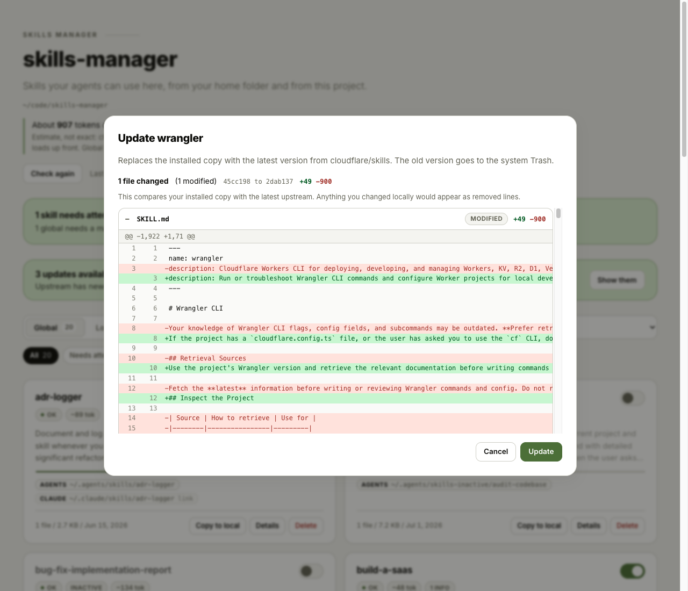
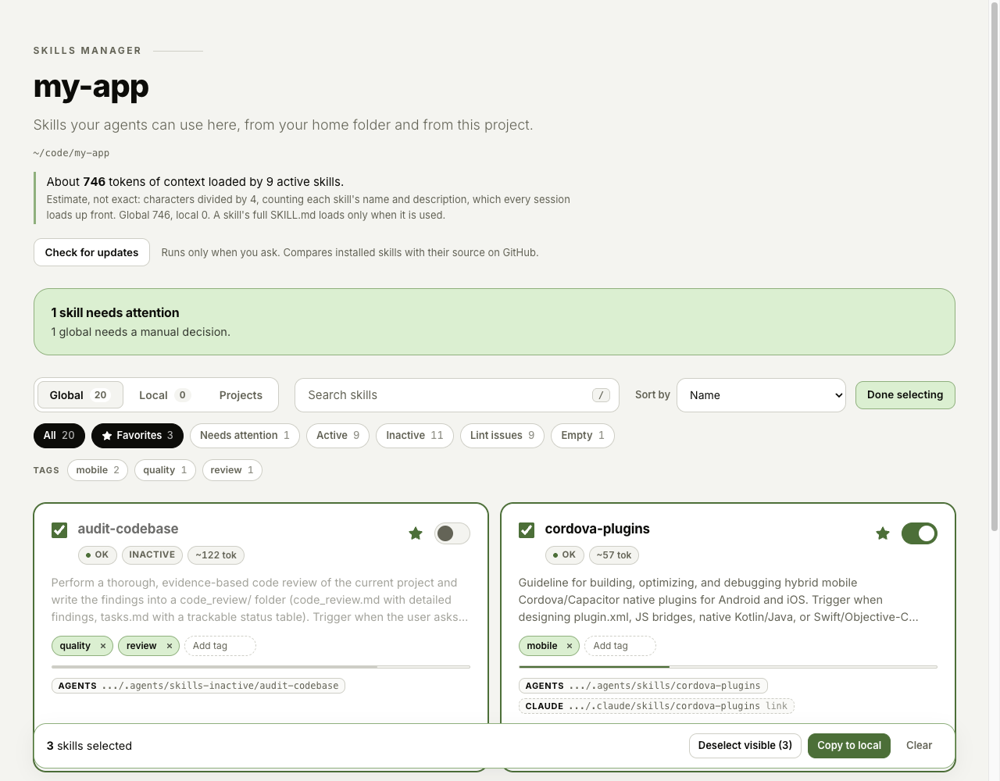
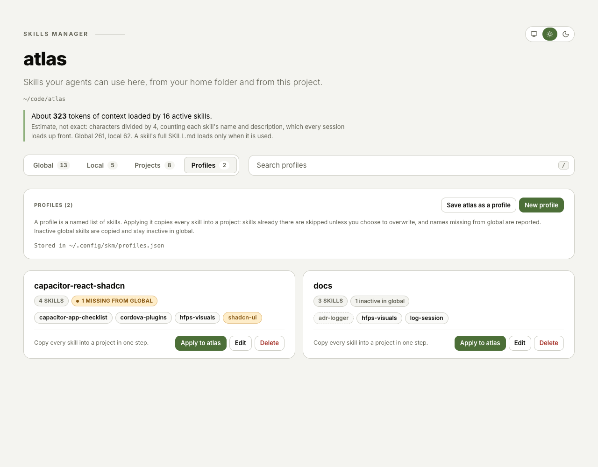
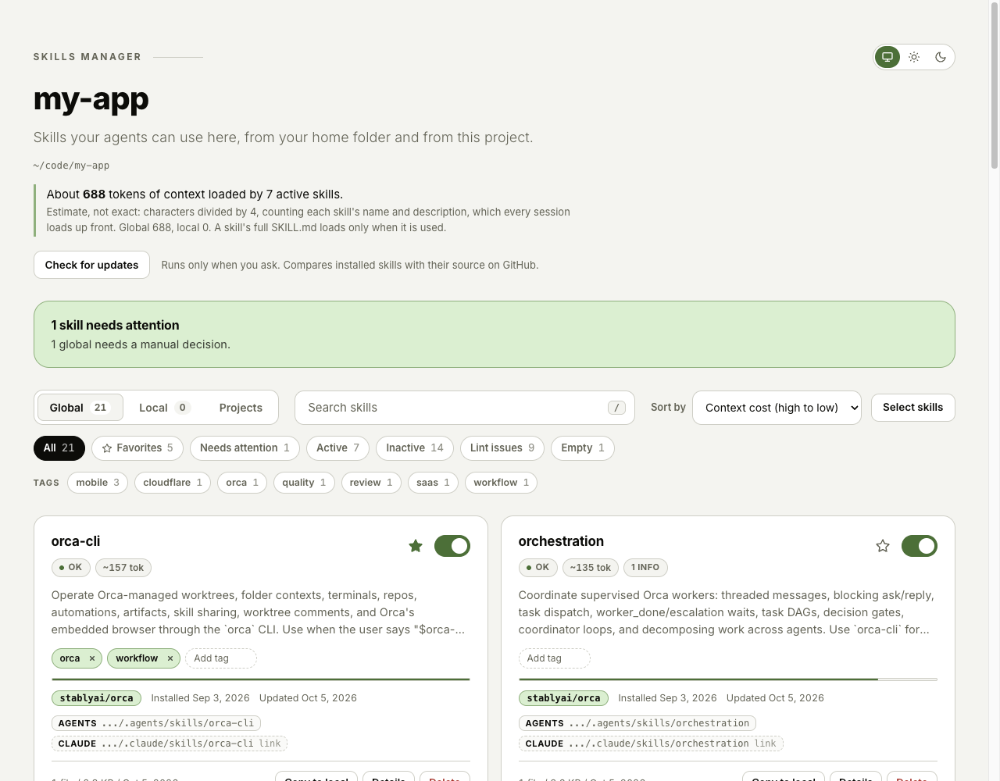
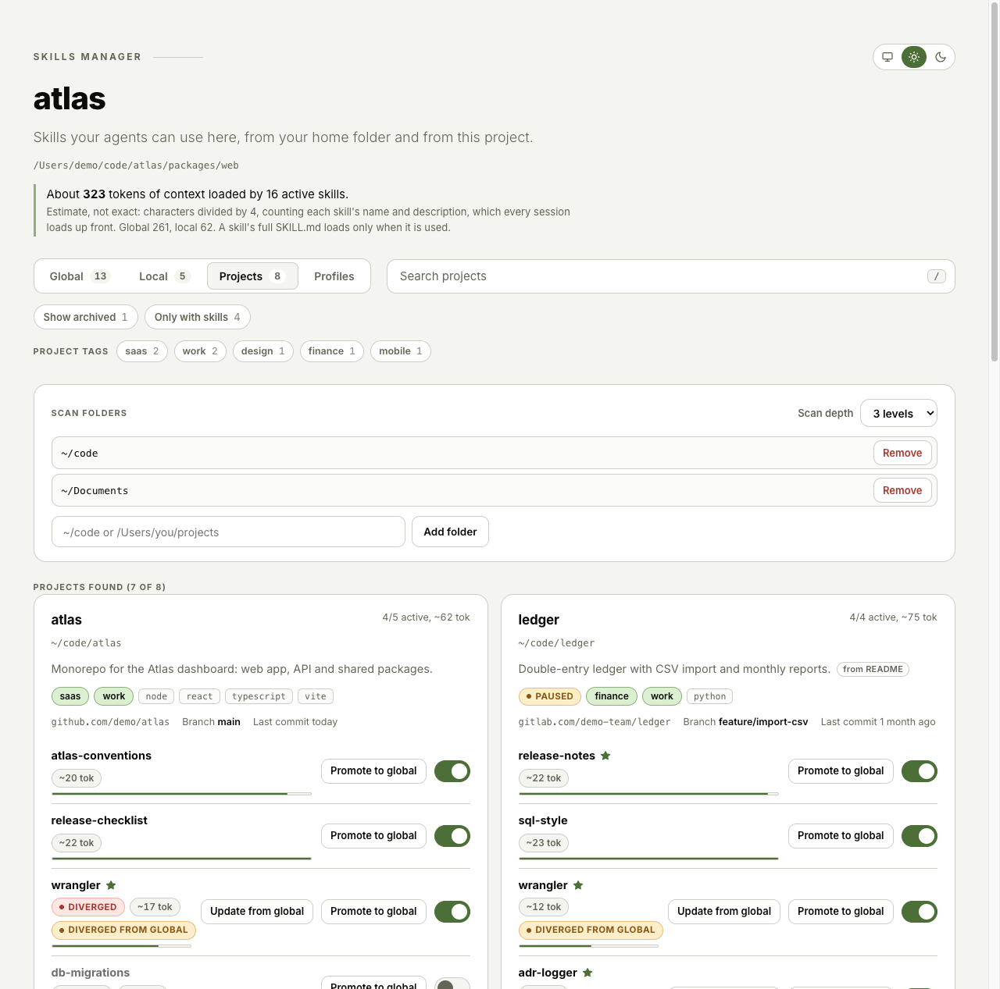
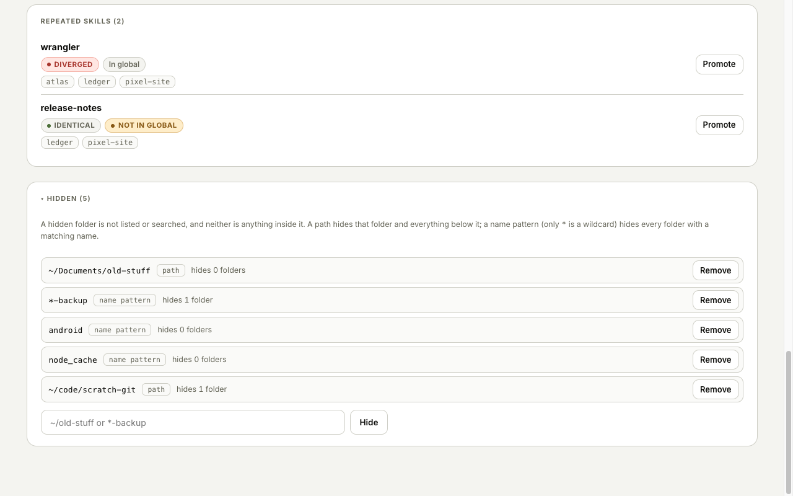

# skm: skills manager

Manage your agent skills (folders with a `SKILL.md`) in one place, from the terminal or
a local web UI. `skm` sees your **global** skills (in your home folder) and your **local**
skills (in the project you are in) at the same time.


- No dependencies, no build step. Node.js 20 or newer is all you need.
- Runs on `127.0.0.1` only; nothing leaves your machine.
- Never really deletes: delete moves the skill to the system Trash (macOS `~/.Trash`, Linux XDG trash; Windows: skm's own `%LOCALAPPDATA%\skm\Trash`, not the Recycle Bin).

## Install

```sh
git clone https://github.com/henriquefps/skills-manager.git
cd skills-manager
node -v   # must be >= 20
```

Pick one way to get the `skm` command in your terminal:

**Alias in your shell config** (installs nothing globally). From inside the cloned folder:

```sh
echo "alias skm='node \"$PWD/bin/skm.mjs\"'" >> ~/.zshrc   # or ~/.bashrc
source ~/.zshrc
```

**Or `npm link`** (puts a `skm` command on your PATH):

```sh
npm link
```

Check it with `skm --help`.

## How skills are organized

`skm` assumes this convention, and the `normalize` command brings your skills to it.

| What | Where |
| --- | --- |
| Global central store | `~/.agents/skills/<name>/` (real folder) |
| Claude view (global) | `~/.claude/skills/<name>` (symlink to the central folder) |
| Inactive global skills | `~/.agents/skills-inactive/<name>/` |
| Deleted skills | The system Trash: `~/.Trash` (macOS) `~/.local/share/Trash` (Linux) or `%LOCALAPPDATA%\skm\Trash` (Windows, not the Recycle Bin), outside the repo |
| Local skills | `<project>/.claude/skills` and/or `<project>/.agents/skills` |
| Inactive local skills | `skills-inactive` next to where the skill was |

The project root is the nearest ancestor of the current directory that has `.git`,
`.agents` or `.claude`.

## Quick start

```sh
cd my-project
skm            # opens the web UI (port 4747) for global + local
skm list       # table in the terminal
skm doctor     # lists problems and the command that fixes each one
```

## The web UI

Running `skm` with no arguments starts the server and opens your browser. There you can:

- switch between **Global** and **Local**, search, and filter by status;
- **activate/deactivate** a skill with its toggle;
- **Promote** a local skill to global, or **Copy to local** a global one;
- **Normalize** a skill with a problem (for `diverged`, pick which side to keep);
- **Delete** (moves it to the system Trash), with a confirmation that shows the exact destination;
- open **Details** to see the `SKILL.md` and the file tree;
- use **Fix all** in the problems banner, with a preview of what will change;
- press **Check for updates** to see which tracked skills are outdated, and **Update** them one by one, with a diff of what will change;
- see the **context cost** of every skill and the total for your active ones, and sort by it;
- see **lint** findings per skill and filter by them;
- open the **Projects** tab to browse your projects (what they are, their stack, tags and status) and their skills;
- switch the **theme** (System, Light or Dark) with the toggle in the top right corner; your choice is remembered in the browser;
- mark skills as **favorites**, add **tags**, filter by them, and copy several skills into the project at once;
- keep **profiles** (named skill kits) in the **Profiles** tab and **Apply** one to a project in one step;
- open **Instructions** on a project card to see its `CLAUDE.md` / `AGENTS.md` files, which are links or plain copies, and a diff of any two (read only);
- open the **Health** tab for broken links, missing sources, forgotten inactive folders and diverged copies, each with a fix button.



Options: `--port <n>` picks the port (if it is taken, the next free one is used) and
`--no-open` skips opening the browser.

## Commands

```
skm                       open the UI for the current directory
skm list [--json]         global and local skills with status
skm doctor                problems found and the suggested fix
skm normalize [name|--all] [--keep agents|claude] [--dry-run]
skm activate <name>       [--local|--global]
skm deactivate <name>     [--local|--global]
skm promote <name>        local -> global (copy)   [--overwrite]
skm pull <name>           global -> local (copy)   [--overwrite] [--target agents|claude]
skm refresh <name...>     replace local copies with the global one   [--dry-run] [--yes]
skm delete <name>         [--local|--global]   # moves to the system Trash; restore it from there by hand
skm outdated [--json]     check the GitHub source of each tracked global skill
skm update <name>         [--force] [--dry-run] [--yes]
skm update --all          [--force] [--dry-run] [--yes]   # only the ones with an update available
skm diff <name>           [--json]   # installed vs upstream, before updating
skm diff <name> --local   [--json]   # local vs global, before refreshing
skm cost                  [--json] [--all]   # estimated context tokens of active skills
skm lint [name]           [--json] [--all]   # check SKILL.md content; exit 1 on errors
skm fav <name...>         |   skm unfav <name...>   # favorites
skm tag <name> <tag...>   |   skm untag <name> <tag...>   |   skm tags
skm list --fav            |   skm list --tag <tag>   # filters (FAV and TAGS columns)
skm pull <name...>        # copy one or more global skills (inactive ones too) into this project
skm projects              [--json] [--brief] [--all]   # scan the configured project folders
skm projects find <words...>   [--json] [--brief]   # search projects by name, description, tags, stack
skm projects show <name|path>  [--json]   # full sheet of one project
skm projects ignore <name|path|glob...>   |   skm projects unignore <entry...>   |   skm projects ignored   # hide folders from the scan
skm projects set <name|path>   [--desc "..."] [--tags a,b] [--add-tag t] [--rm-tag t] [--status active|paused|archived] [--note "..."] [--clear desc|tags|notes|status]
skm projects add <path>   |   skm projects rm <path>   |   skm projects depth <n>
skm config                # show the config file path and content
skm profile list|show|save|apply|rm   # named skill kits (skm profile --help)
skm check                 [--json] [--global|--local|--projects]   # health check with fixes; exit 1 on errors
skm instructions [name|path]   [--json]   # CLAUDE.md / AGENTS.md files of a project and the global one (read only)
skm instructions diff <a> <b>  [--project <name|path>] [--json]   # diff two of them (global = ~/.claude/CLAUDE.md)
```

General options: `--yes` (skip confirmation), `--dry-run` (only show what would happen),
`--json`, `--port <n>`, `--no-open`.

If the same name exists in both global and local, pass `--local` or `--global`.

## Checking and updating skills


Skills installed with `npx skills` are recorded in `~/.agents/.skill-lock.json` (repo, path in the
repo and the git tree hash of the folder). skm reads it, never needs it, and shows the repo in the
`ORIGIN` column of `skm list`. A skill whose folder no longer matches the recorded hash is marked
`[modified]`.

`skm outdated` asks GitHub (one call pair per repo; it uses `GITHUB_TOKEN`, `GH_TOKEN` or `gh auth token`
when available, otherwise it is anonymous) and reports `up-to-date`, `update-available`,
`removed-upstream` or `unreachable`. It runs only when you ask.

`skm update <name>` clones the repo (with your git credentials), moves the old folder to the system
Trash, copies the new one in place and updates the hash and `updatedAt` in the lock file; all other
lock fields and its indentation are kept. A modified skill is refused unless you pass `--force`; an
inactive skill is updated where it lives. Use `--dry-run` to see the plan first.

Before you confirm, `skm diff <name>` (and the Update dialog in the UI) shows what will change,
file by file. The diff goes from your installed copy to upstream, so anything you edited locally
shows up as removed lines.



## Favorites, tags and your skill library

An inactive skill is not lost: it is a skill you keep switched off so it does not cost context, and
copy into a project when you need it. **Copy to local** (and `skm pull`) works on inactive global skills
too: the copy in the project is a real, active folder, and the global one stays inactive.

To find those skills quickly, mark them with a star and add tags (lowercase letters, digits and
hyphens, up to 8 per skill). In the UI, filter by **Favorites** or by tags (selecting several tags
means all of them), turn on **Select skills**, **Select all visible** and **Copy to local** to bring
a whole set into the project in one go. A skill that already exists there fails on its own and does
not stop the others, unless you choose **Overwrite**.

```sh
skm fav cordova-plugins capacitor-app-checklist
skm tag cordova-plugins mobile
skm list --tag mobile
skm pull cordova-plugins capacitor-app-checklist   # from inside the project
```

Favorites and tags are saved by skill name in `~/.config/skm/config.json`, next to the project
folders, so they belong to your machine and never touch the skill folders.



### Refreshing a local skill from the global copy

When a project has an older copy of a global skill, skm marks it **Differs from global** (in the project's skill
list) or **Diverged from global** (in the Projects tab). **Update local from global** replaces the local folder with
the global one: you see the diff first (local edits show up as removed lines), the old local folder goes to the system
Trash, and an inactive global skill is only read and stays inactive. A project card with several diverged skills
offers to update them all at once.

```sh
skm diff wrangler --local          # what would change
skm refresh wrangler --dry-run     # the plan
skm refresh wrangler sql-style     # several at once; asks before replacing
```

## Profiles: skill kits for new projects

A **profile** is a named list of skills, for example `capacitor-react-shadcn` or `docs`. Applying it to a project
copies every skill in it, the same way **Copy to local** does: skills already in the project are skipped (or
replaced with **Overwrite**, the old copy going to the system Trash), names that have no global skill are reported
as missing, and inactive global skills are copied but stay inactive in global. Saving a project's setup as a profile
stores its active skills, so a setup moves from one project to the next.

```sh
skm profile save mobile capacitor-app-checklist cordova-plugins hfps-visuals   # from a list of skills
skm profile save atlas                       # from inside a project: its active skills
skm profile list                             # every profile and its skills
skm profile show mobile                      # where each skill comes from (global active / inactive / missing)
skm profile apply mobile --dry-run           # from inside the new project: see what would be copied
skm profile apply mobile                     # [--target agents|claude] [--overwrite]
skm profile rm mobile                        # removes the profile only, never a skill folder
```

In the UI, the **Profiles** tab creates, renames, edits and deletes profiles (with Undo), and each project card in
**Projects** has **Apply profile** and **Save as profile**. Every apply shows a preview first.

Profiles are stored in `~/.config/skm/profiles.json`, a separate file from the config so it is easy to share.
A profile holds skill names only, no versions.



## Instruction files (CLAUDE.md / AGENTS.md)

Besides skills, an agent is steered by its instruction files. For each project skm looks at `CLAUDE.md`, `AGENTS.md`,
`CLAUDE.local.md` and `.claude/CLAUDE.md` at the project root, plus your global `~/.claude/CLAUDE.md`, and tells you:

- which of them exist, with their size in lines and estimated tokens;
- which one is a **symlink** to another: a valid way to share one file, reported as a link and never flagged;
- which one is a **plain copy** of another (a symlink would keep them in sync);
- when two of `CLAUDE.md`, `AGENTS.md` and `.claude/CLAUDE.md` **differ** (`CLAUDE.local.md` and the global file are
  meant to differ, so only copies of them are flagged).

```sh
skm instructions                    # the current project (or only the global file outside a project)
skm instructions atlas --json       # another project, by name or path
skm instructions diff CLAUDE.md AGENTS.md
skm instructions diff global CLAUDE.md --project atlas
```

`skm projects show` lists them too, and in the UI each project card has an **Instructions** button that opens the files,
the findings and a diff of any two. This is read only: skm never edits, moves or links instruction files (editing is
planned, see `docs/planned-features/instructions-management.md`). Nested files deeper in the tree are not looked at.

## Context cost

Every active skill costs context in every session: the agent loads its `name` and `description`
up front, and the whole `SKILL.md` only when the skill is used. `skm cost` lists the estimated
tokens per skill (characters divided by 4, so an estimate, not an exact count) and the total for
your active skills, so you can see which skills are worth their weight. `skm list` has a `TOK`
column, and the UI shows a badge and a bar on each card, a total in the header, and a sort by cost.



## Lint

`skm lint` checks the content of each `SKILL.md`: missing or broken frontmatter, a name that does not
match the folder or is not a valid name, a missing, very short or very long description (over 1024
characters), a description that never says when to use the skill, broken references to files in the
folder, and very large files. Findings are `error`, `warn` or `info`; `skm lint` exits with 1 if there is
any error, so you can use it in a script.

## Health check

`skm check` (and the **Health** tab in the UI) looks for what is broken or forgotten, and suggests a fix for each finding:

| Finding | Severity | Suggested fix |
| --- | --- | --- |
| `broken-link`: a symlink in a skills folder points at nothing | error | `normalize` (global claude link next to a real agents folder) or `delete` (only unlinks) |
| `missing-source`: an active skill whose links all point at nothing, or whose folder has no `SKILL.md` | error | `delete`, or add a `SKILL.md` |
| `forgotten-inactive`: an inactive folder that is empty, or that nothing refers to (no profile, favorite, tag or source) and is unchanged for 180 days | hint | `activate` or `delete` |
| `diverged`: the same name with different content (a project copy vs global, the `.agents` vs `.claude` copies, or several projects with no global copy) | hint | `refresh` (update local from global), `promote --overwrite` (keep local), `normalize --keep agents\|claude` |

By default it checks global and the current project; `--global`, `--local` or `--projects` (global and every scanned
project) narrow or widen it. It exits with 1 when there is an error. Fixes are the usual actions, so they show what
would change first and move folders to the system Trash instead of deleting them. Similar descriptions competing for
activation are not checked (yet).

## Projects

Skills also live inside your projects. skm does not scan anything by default: tell it where your
projects are, and it looks (up to a depth you choose, 3 by default) for folders with
`.agents/skills` or `.claude/skills`:

```sh
skm projects add ~/code
skm projects add ~/Documents
skm projects
```

The settings are saved in `~/.config/skm/config.json`. In the UI, the **Projects** tab lists the found
projects with their skills, costs and statuses, lets you promote a project skill to global or copy a
global one into a project, and flags **repeated skills**: the same skill name in two or more projects,
marked identical or diverged, and whether it already exists in global. That is the hint to promote it.



### A project index for your agents

`skm projects` doubles as an index of everything you have built. Each project gets facts that skm
computes on every scan (git remote without credentials, branch, last commit date, stack detected from
files like `package.json` or `components.json`, and the first paragraph of the README), plus metadata
you write yourself: a description, tags, a status (`active`, `paused` or `archived`) and notes. Your
metadata is saved by project path in `~/.config/skm/config.json`, never inside the projects.

```sh
skm projects set my-sync-plugin --desc "Background sync plugin for OutSystems mobile apps" --tags work,outsystems
skm projects find sync plugin          # every word must match; best match first
skm projects show my-sync-plugin       # path, remote, branch, last commit, stack, notes, skills
```

A project is any folder with a `.git`, with skills, or with a project file such as `package.json`,
`pyproject.toml` or `config.xml`, so projects without skills show up too. That finds a lot, so you
can **ignore** what you do not want to see:

```sh
skm projects ignore ~/Documents/old-stuff   # a path: hides the folder and everything inside it
skm projects ignore '*-backup' android      # a name pattern (only * is a wildcard): hides every folder with that name
skm projects ignored                        # what is hidden, and how many folders each entry hides
skm projects unignore android
```

Ignored folders are not listed, searched or scanned, unlike `archived`, which keeps a project indexed
and only hides it by default. In the UI, every project card has an **Ignore** button (with an Undo),
and the **Hidden** section at the bottom of the Projects tab lists the entries so you can bring them
back.



You can edit the same fields from the **Projects** tab in the UI, which also searches them and hides
archived projects until you ask for them.

#### The `skm` skill

The repo ships a skill for your agent in `skills/skm/SKILL.md`. It teaches the agent to resolve "that
sync plugin I built" to a path with `skm projects find`, read the sheet, and save what you tell it
about a project. Install it like any other skill:

```sh
npx skills add henriquefps/skills-manager
```

The agent has to be able to run `skm`, and **shell aliases are not visible to agents**. Make `skm` a
real executable on your PATH, for example with `npm link` from the cloned folder.

## Recipes

**Clean up duplicates between `.agents` and `.claude`**

```sh
skm doctor
skm normalize --all --dry-run   # see what will change
skm normalize --all
```

This adopts skills that only exist in `.claude` into `.agents`, replaces identical copies
with a symlink, and creates the missing symlinks. `diverged` skills (different content on
each side) are never resolved on their own:

```sh
skm normalize log-session --keep agents   # or --keep claude
```

**Turn a skill off without deleting it**

```sh
skm deactivate wrangler
skm activate wrangler     # to bring it back
```

When you deactivate a **local** skill, `skm` also adds `skills-inactive/` to the project's
`.gitignore` (only if one exists and nothing already mentions it), so switched-off skills
never end up in your repo.

**Make a project skill global**

```sh
cd my-project
skm promote my-skill
```

**Use a global skill only in this project**

```sh
skm pull my-skill                  # copies into the project's .claude/skills
skm pull my-skill --target agents  # or into .agents/skills
```

## Skill statuses

| Status | Meaning | Fix |
| --- | --- | --- |
| `ok` | All good | |
| `needs-link` | Exists in `.agents`, the symlink in `.claude` is missing | `normalize` |
| `duplicate` | Real folder on both sides, identical | `normalize` |
| `diverged` | Real folder on both sides, different content | `normalize --keep agents\|claude` |
| `claude-only` | Only exists in `.claude` | `normalize` (adopts it into `.agents`) |
| `broken-link` | Symlink points to something that does not exist | review manually |
| `wrong-link` | The `.claude` symlink points somewhere else | `normalize` |
| `empty` | Folder without a `SKILL.md` | review or delete |
| `conflict` | Has Syncthing `*.sync-conflict-*` files | resolve manually |

Hidden folders such as `.trash`, `.stfolder` and `synced` are ignored.

## Development

```sh
npm test    # node:test, always on temp folders
```

To try it without touching your real home, point the home at any folder:

```sh
SKM_HOME=/tmp/fake-home skm list
```

Layout:

```
bin/skm.mjs      CLI
src/core/        filesystem logic (scan, actions)
src/server.mjs   HTTP server + JSON API
src/ui/          UI (HTML, JS and CSS, HFPS theme)
docs/ARCHITECTURE.md   full contract (model, actions, API)
```
